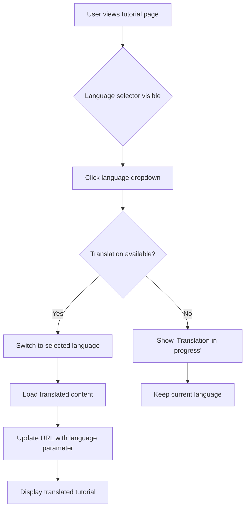
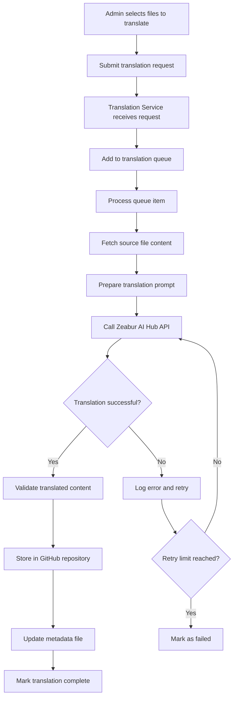
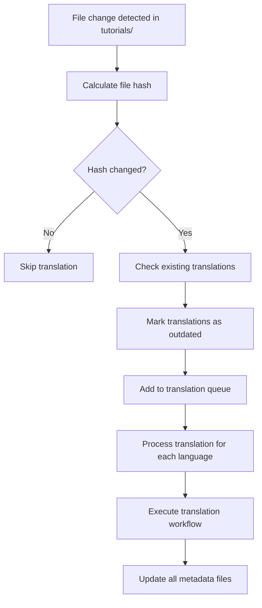

# Translation Pipeline System Design

## Overview

This design outlines a comprehensive translation pipeline system that automatically translates tutorial content from English to Chinese and Japanese using Zeabur AI Hub's LLM services. The system stores translated content in GitHub repositories and provides language selection capability through the web interface.

## System Objectives

Provide multilingual support for tutorial content with the following capabilities:
- Translate tutorials from English to Chinese and Japanese
- Store translations in organized GitHub repositories
- Enable manual or automatic translation triggers
- Maintain content structure and formatting across languages
- Provide seamless language switching in the web interface

## Target Languages

- English (source language, default)
- Chinese Simplified (zh-CN)
- Japanese (ja-JP)

## Architectural Components

### Component 1: Translation Service

A backend service responsible for orchestrating the translation workflow.

#### Responsibilities
- Accept translation requests (manual or automated)
- Interface with Zeabur AI Hub API for translation
- Manage translation queue and processing status
- Handle batch processing for multiple tutorials
- Validate translated content quality
- Coordinate with GitHub storage service

#### Input Parameters
- Source tutorial file path
- Target language code
- Translation mode (manual trigger or auto-detect)
- Optional: translation quality preferences

#### Output
- Translated content in target language
- Translation metadata (timestamp, model used, quality score)
- Processing status and error logs

### Component 2: GitHub Storage Manager

A service module for managing translated content in GitHub repositories.

#### Repository Structure
```
Translated content organization in GitHub:

Main Repository: ai_builders_tutorial
  |
  +-- tutorials/               (English - original)
  |
  +-- tutorials-zh-cn/         (Chinese translations)
  |     |-- Audio/
  |     |-- Automation/
  |     |-- [same structure as original]
  |
  +-- tutorials-ja-jp/         (Japanese translations)
        |-- Audio/
        |-- Automation/
        |-- [same structure as original]
```

#### Responsibilities
- Create and manage separate directories for each language
- Maintain identical folder structure across languages
- Store translated files with original filenames
- Track translation status and version mapping
- Handle file commit operations
- Manage translation metadata files

#### Metadata Structure
Each language directory contains a metadata file tracking translation status:

| Field | Type | Description |
|-------|------|-------------|
| original_path | string | Path to source English file |
| translated_path | string | Path to translated file |
| language | string | Target language code |
| translation_date | ISO 8601 datetime | When translation was completed |
| source_hash | string | Hash of source content for change detection |
| model_used | string | Zeabur AI Hub model identifier |
| status | enum | completed, pending, failed, outdated |

### Component 3: Zeabur AI Hub Integration

Translation execution module using Zeabur AI Hub API.

#### API Configuration
- Endpoint: Use Tokyo or San Francisco endpoint based on availability
- Model Selection: Use gpt-4o or claude-sonnet-4-5 for high-quality translation
- API Authentication: Zeabur API key from environment configuration

#### Translation Prompt Strategy

The system uses specialized prompts for different content types:

**For Markdown Files (MDX):**
```
Prompt structure:
- Preserve all markdown formatting syntax
- Maintain code block boundaries and language tags
- Keep URLs and links unchanged
- Translate only natural language text
- Preserve frontmatter structure but translate values
- Maintain heading hierarchy
```

**For Jupyter Notebooks (IPYNB):**
```
Prompt structure:
- Translate markdown cell content only
- Preserve code cells completely unchanged
- Keep output cells in original language (technical outputs)
- Maintain cell execution order
- Preserve notebook metadata structure
```

#### Quality Assurance
- Validate translated content structure matches original
- Verify all code blocks remain intact
- Check that links and references are preserved
- Ensure technical terminology consistency

### Component 4: File Change Detection System

Monitors tutorial directory for new or modified files to trigger automatic translation.

#### Detection Mechanisms

**Manual Trigger:**
- Admin interface endpoint to initiate translation
- Select specific files or bulk translate entire categories
- Priority queue for manual requests

**Automatic Detection:**
- File system watcher on services/frontend/tutorials directory
- Git hook integration to detect commits
- Periodic scanning for content changes
- Compare source file hash with metadata records

#### Change Detection Logic
1. Calculate hash of current source file
2. Compare with stored hash in translation metadata
3. If hash differs, mark translation as outdated
4. Queue file for re-translation
5. Update metadata after successful translation

### Component 5: Language Selector UI Component

Frontend component enabling language switching in the web interface.

#### Placement
- Located in top-right corner of the navigation bar
- Visible on all tutorial pages
- Persistent across page navigation

#### User Interaction Flow



#### Implementation Approach
- Dropdown menu with language flags and names
- Indicator showing translation availability status
- URL parameter for language selection (e.g., ?lang=zh-cn)
- Local storage to remember user's language preference
- Fallback to English if translation unavailable

#### Visual Design Elements
| Element | Description |
|---------|-------------|
| Language Icon | Globe icon indicating internationalization |
| Dropdown Trigger | Current language display with chevron |
| Language Options | Flag icon + language name (English, 中文, 日本語) |
| Status Badge | Green dot for available, yellow for in-progress |

### Component 6: Content Router

Routing logic to serve appropriate language version based on user selection.

#### Route Structure
```
Current route pattern:
/tutorials/{category}/{tutorial-name}

Enhanced route pattern options:

Option 1 - Query Parameter:
/tutorials/{category}/{tutorial-name}?lang=zh-cn

Option 2 - Path Prefix:
/zh-cn/tutorials/{category}/{tutorial-name}

Recommended: Option 1 (query parameter)
- Simpler implementation
- Preserves existing URL structure
- Better for SEO canonical URLs
```

#### Routing Logic

When a tutorial page is requested:
1. Extract language parameter from URL or user preference
2. Check if translation exists for selected language
3. If exists, load translated content from GitHub repository
4. If not exists, display English version with notification
5. Update UI to show current language and availability

#### Content Loading Strategy
- Load metadata first to check translation status
- Fetch translated file from appropriate GitHub directory
- Parse content (notebook or markdown) same as English
- Apply same rendering logic to translated content
- Cache frequently accessed translations

## Translation Workflow

### Manual Translation Flow



### Automatic Translation Flow



## Data Models

### Translation Request

| Field | Type | Required | Description |
|-------|------|----------|-------------|
| request_id | UUID | Yes | Unique identifier for request |
| source_files | array of strings | Yes | List of tutorial file paths |
| target_languages | array of strings | Yes | Language codes to translate to |
| priority | enum | No | manual, automatic (default: automatic) |
| requester | string | No | User identifier for manual requests |
| created_at | datetime | Yes | Request timestamp |
| status | enum | Yes | queued, processing, completed, failed |

### Translation Job

| Field | Type | Required | Description |
|-------|------|----------|-------------|
| job_id | UUID | Yes | Unique job identifier |
| request_id | UUID | Yes | Parent request identifier |
| source_file | string | Yes | Original tutorial file path |
| target_language | string | Yes | Target language code |
| model_used | string | Yes | Zeabur AI Hub model name |
| started_at | datetime | No | Processing start time |
| completed_at | datetime | No | Processing completion time |
| status | enum | Yes | pending, translating, validating, storing, completed, failed |
| error_message | string | No | Error details if failed |
| retry_count | integer | Yes | Number of retry attempts |

### Translation Metadata (stored in JSON)

```
File location: tutorials-{lang}/translation-metadata.json

Structure:
{
  "translations": {
    "{original-file-path}": {
      "original_path": "Audio/deepgram_tutorial.ipynb",
      "translated_path": "tutorials-zh-cn/Audio/deepgram_tutorial.ipynb",
      "language": "zh-CN",
      "translation_date": "2025-12-19T10:30:00Z",
      "source_hash": "abc123def456",
      "model_used": "gpt-4o",
      "status": "completed"
    }
  },
  "last_updated": "2025-12-19T10:30:00Z",
  "version": "1.0"
}
```

## Configuration Requirements

### Environment Variables

| Variable | Description | Required | Example |
|----------|-------------|----------|---------|
| ZEABUR_API_KEY | Zeabur AI Hub API key | Yes | sk-xxx |
| ZEABUR_ENDPOINT | API endpoint selection | No | tokyo (default) |
| TRANSLATION_MODEL | Default model for translation | No | gpt-4o (default) |
| GITHUB_TOKEN | GitHub personal access token | Yes | ghp_xxx |
| GITHUB_REPO_OWNER | Repository owner name | Yes | theaibuilders |
| GITHUB_REPO_NAME | Repository name | Yes | ai_builders_tutorial |
| TRANSLATION_BATCH_SIZE | Files per batch | No | 5 (default) |
| TRANSLATION_RETRY_LIMIT | Max retry attempts | No | 3 (default) |
| AUTO_TRANSLATE_ENABLED | Enable automatic translation | No | true (default) |

### Model Selection Guidelines

| Use Case | Recommended Model | Rationale |
|----------|------------------|-----------|
| Technical tutorials with code | gpt-4o | Better at preserving code structure |
| Markdown-heavy content | claude-sonnet-4-5 | Superior markdown formatting |
| Batch processing | gpt-4o-mini | Cost-effective for volume |
| High-stakes content | claude-sonnet-4-5 | Highest quality output |

## API Endpoints (Backend Service)

### Translation Management

**POST /api/translations/request**
- Purpose: Submit manual translation request
- Request Body: Translation request object
- Response: Request ID and initial status

**GET /api/translations/status/{request_id}**
- Purpose: Check translation request status
- Response: Request status and progress details

**GET /api/translations/available**
- Purpose: List all available translations for a file
- Query Parameters: source_file_path
- Response: Array of available language codes

**POST /api/translations/retrigger**
- Purpose: Re-translate specific files
- Request Body: File paths and target languages
- Response: New request ID

### Configuration Management

**GET /api/translations/config**
- Purpose: Retrieve current translation configuration
- Response: Configuration settings

**PUT /api/translations/config**
- Purpose: Update translation configuration
- Request Body: Configuration updates
- Response: Updated configuration

## Frontend Integration

### Language Selector Component Structure

The component integrates into TutorialLayout.astro:

```
Component hierarchy:
TutorialLayout.astro
  |-- Header navigation
        |-- LanguageSelector (new component)
              |-- Current language display
              |-- Dropdown menu
              |-- Translation status indicators
```

### State Management

| State Variable | Type | Purpose |
|---------------|------|---------|
| currentLanguage | string | Active language code |
| availableLanguages | array | Languages with translations ready |
| translationStatus | object | Status per language (available/pending/none) |
| userPreference | string | User's saved language preference |

### User Experience Considerations

**Loading States:**
- Show spinner while checking translation availability
- Display progress indicator during language switch
- Provide fallback message if translation fails to load

**Error Handling:**
- Gracefully fall back to English if translation unavailable
- Display user-friendly error messages
- Option to request translation if not available

**Accessibility:**
- Keyboard navigation support for language selector
- Screen reader announcements for language changes
- ARIA labels for language options

## GitHub Integration Details

### Repository Access Configuration

**Authentication:**
- Use GitHub Personal Access Token with repo write permissions
- Store token securely in environment variables
- Implement token rotation capability

**Branch Strategy:**
- Main branch contains all languages
- Use separate directories for language isolation
- Optional: Use branches for translation staging

### File Operations

**Creating Translated Files:**
1. Verify target directory exists
2. Create directory structure if needed
3. Write translated content
4. Commit with descriptive message
5. Update metadata file in same commit

**Commit Message Format:**
```
Translation: Add {language} version of {tutorial-name}

- Source: {original-file-path}
- Target: {translated-file-path}
- Model: {model-name}
- Date: {translation-date}
```

### Conflict Resolution

If source file changes during translation:
- Detect conflict by comparing source hash
- Abort current translation
- Re-queue file with updated content
- Notify admin of conflict resolution

## Performance Considerations

### Optimization Strategies

**Batch Processing:**
- Group multiple files per API request when possible
- Process tutorials by category to maintain context
- Implement parallel processing for multiple languages

**Caching:**
- Cache translation metadata in memory
- Store frequently accessed translations in CDN
- Use browser localStorage for language preference

**Rate Limiting:**
- Respect Zeabur AI Hub API rate limits
- Implement exponential backoff for retries
- Queue management to avoid overwhelming API

### Estimated Processing Times

| Content Type | Average Size | Translation Time | Notes |
|-------------|-------------|------------------|-------|
| Small tutorial | < 5KB | 10-20 seconds | Simple markdown |
| Medium tutorial | 5-20KB | 30-60 seconds | Notebook with code |
| Large tutorial | > 20KB | 60-120 seconds | Complex notebook |

## Monitoring and Observability

### Metrics to Track

**Translation Metrics:**
- Total translations completed per day
- Average translation time per language
- Success rate percentage
- Retry rate and failure reasons

**API Usage:**
- Zeabur API calls per day
- Token consumption per translation
- Cost tracking per language

**User Engagement:**
- Language selection frequency
- Most accessed translated tutorials
- User language preferences distribution

### Logging Requirements

**Log Events:**
- Translation request received
- Translation started and completed
- API calls to Zeabur and GitHub
- Errors and retry attempts
- User language switches

**Log Format:**
Structured JSON logs with fields: timestamp, event_type, details, user_id (if applicable), status

## Security Considerations

### API Key Management
- Store Zeabur API key in secure environment variables
- Never expose keys in frontend code
- Implement key rotation capability
- Monitor for unauthorized API usage

### GitHub Token Security
- Use tokens with minimum required permissions
- Implement token expiration and renewal
- Audit repository access logs
- Restrict translation service to specific branches/paths

### Content Validation
- Sanitize translated content before storage
- Validate that no malicious code is injected
- Verify translation maintains original intent
- Check for inappropriate content in translations

## Rollout Strategy

### Phase 1: Foundation (Week 1-2)
- Set up Zeabur AI Hub integration
- Implement basic translation service
- Create GitHub storage structure
- Build translation metadata system

### Phase 2: Core Translation (Week 3-4)
- Develop translation prompt templates
- Implement content validation logic
- Create manual translation trigger
- Build translation queue management

### Phase 3: Automation (Week 5-6)
- Implement file change detection
- Build automatic translation trigger
- Add retry and error handling
- Create admin monitoring dashboard

### Phase 4: Frontend Integration (Week 7-8)
- Build language selector component
- Implement content routing logic
- Add translation status indicators
- Integrate user preference storage

### Phase 5: Testing and Optimization (Week 9-10)
- Test translation quality across languages
- Optimize batch processing performance
- Implement caching strategies
- User acceptance testing

## Success Criteria

**Functional Requirements:**
- Successfully translate tutorials to Chinese and Japanese
- Store translations in organized GitHub structure
- Enable language switching in web interface
- Support both manual and automatic translation triggers

**Quality Requirements:**
- Translation accuracy rate > 95% (human evaluation)
- Preserve all code blocks and formatting
- Maintain consistent technical terminology
- No broken links or references

**Performance Requirements:**
- Translation processing time < 2 minutes per tutorial
- Language switching response time < 1 second
- Support concurrent translation of 10+ files
- System uptime > 99.5%

**User Experience Requirements:**
- Intuitive language selector interface
- Clear indication of translation availability
- Seamless content switching without page reload
- Graceful fallback for unavailable translations

## Future Enhancements

**Potential Improvements:**
- Add more languages (Korean, Spanish, French)
- Implement translation review workflow with human editors
- Build translation memory to improve consistency
- Add A/B testing for different translation models
- Create translation analytics dashboard
- Implement incremental translation for partial content updates
- Add community contribution system for translation feedback
- Support bidirectional translation updates
