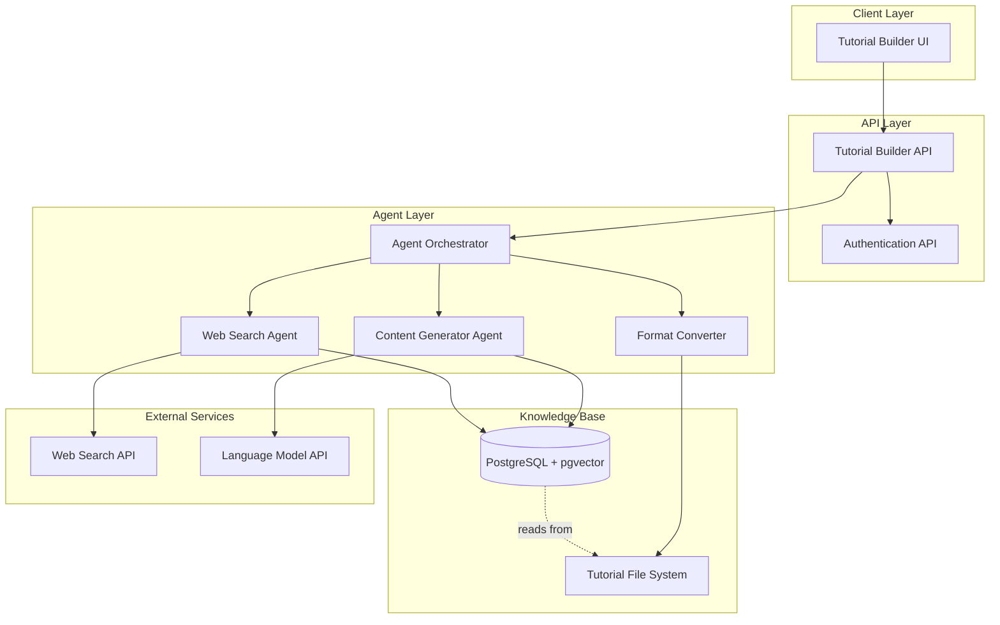
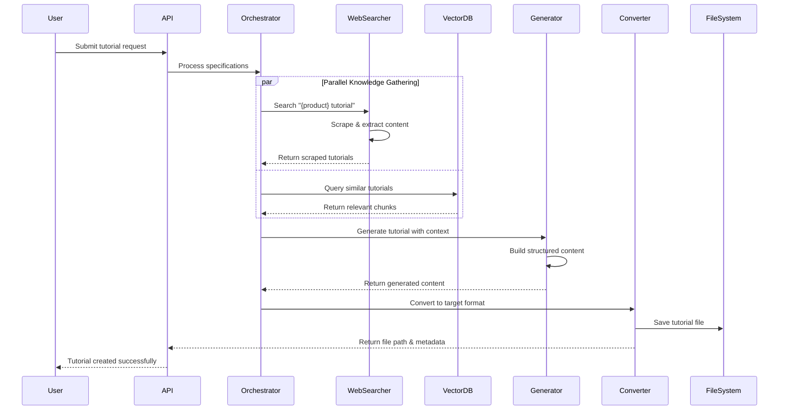
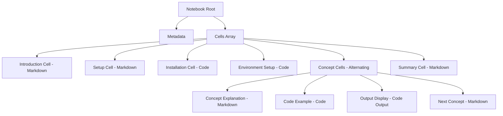
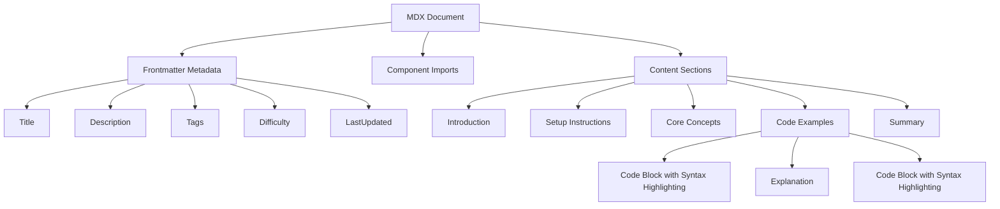
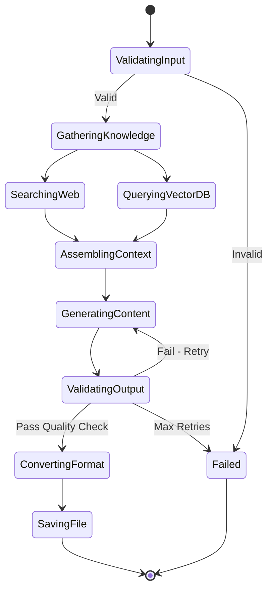

# Tutorial Builder Agent - Design Document

## Overview

An AI-powered agent system that automatically generates high-quality tutorials in either Jupyter Notebook or MDX format by leveraging existing tutorial knowledge, web-scraped resources, and user-defined specifications. The system uses vector embeddings stored in PostgreSQL with pgvector for efficient semantic search and retrieval.

## Business Value

- Accelerates tutorial creation from hours to minutes
- Maintains consistent quality and structure across all tutorials
- Leverages existing tutorial patterns and best practices
- Reduces manual research effort through automated web scraping
- Scales tutorial production to cover more products and frameworks

## System Architecture

### High-Level Components

## Core Features

### Input Specifications

The agent accepts structured input parameters to customize tutorial generation:

| Parameter | Type | Description | Example |
|-----------|------|-------------|----------|
| Product/Framework Name | String | Name of the technology or framework | "LangGraph", "CrewAI", "Supabase" |
| Output Format | Enum | Desired output format | "ipynb" or "mdx" |
| Target Word Count | Number | Approximate number of words | 2000-5000 |
| Target Lines of Code | Number | Approximate code examples | 50-300 |
| Difficulty Level | Enum (Optional) | Tutorial complexity | "Beginner", "Intermediate", "Advanced" |
| Category | String (Optional) | Tutorial section placement | "Frameworks", "Data and Memory", etc. |
| Additional Requirements | String (Optional) | Special instructions or focus areas | "Focus on RAG implementation" |

### Tutorial Generation Workflow

## Data Model

### PostgreSQL Schema with pgvector

#### tutorials_embeddings Table

| Column | Type | Description |
|--------|------|-------------|
| id | SERIAL PRIMARY KEY | Unique identifier |
| tutorial_path | VARCHAR(500) | Relative path to tutorial file |
| tutorial_name | VARCHAR(200) | Tutorial display name |
| category | VARCHAR(100) | Tutorial category/section |
| chunk_index | INTEGER | Position of chunk within tutorial |
| chunk_text | TEXT | Actual content chunk |
| chunk_type | VARCHAR(50) | Type: markdown, code, explanation |
| embedding | VECTOR(1536) | OpenAI text-embedding-3-small vector |
| metadata | JSONB | Additional metadata |
| created_at | TIMESTAMP | Record creation time |
| updated_at | TIMESTAMP | Last update time |

**Indexes:**
- HNSW index on embedding column for fast similarity search
- B-tree index on tutorial_path for lookup
- B-tree index on category for filtering

#### web_scraped_content Table

| Column | Type | Description |
|--------|------|-------------|
| id | SERIAL PRIMARY KEY | Unique identifier |
| source_url | TEXT | Original URL of content |
| product_name | VARCHAR(200) | Associated product/framework |
| content_text | TEXT | Extracted text content |
| content_type | VARCHAR(50) | Type: tutorial, documentation, blog |
| embedding | VECTOR(1536) | Content embedding |
| metadata | JSONB | Additional metadata (author, date, etc.) |
| scraped_at | TIMESTAMP | Scraping timestamp |
| quality_score | DECIMAL(3,2) | Content quality assessment (0-1) |

**Indexes:**
- HNSW index on embedding column
- B-tree index on product_name
- GIN index on metadata for JSON queries

#### generation_history Table

| Column | Type | Description |
|--------|------|-------------|
| id | SERIAL PRIMARY KEY | Unique identifier |
| user_id | INTEGER | User who requested generation |
| product_name | VARCHAR(200) | Target product/framework |
| output_format | VARCHAR(10) | ipynb or mdx |
| target_word_count | INTEGER | Requested word count |
| target_code_lines | INTEGER | Requested code lines |
| actual_word_count | INTEGER | Actual generated word count |
| actual_code_lines | INTEGER | Actual generated code lines |
| output_file_path | VARCHAR(500) | Generated file path |
| generation_time_seconds | DECIMAL(10,2) | Time taken to generate |
| status | VARCHAR(50) | Status: pending, completed, failed |
| created_at | TIMESTAMP | Request timestamp |

### Tutorial Content Structure

#### Jupyter Notebook Format

#### MDX Format

## Agent Components

### Agent Orchestrator

**Purpose:** Coordinates the entire tutorial generation workflow

**Responsibilities:**
- Validates input specifications
- Manages workflow state transitions
- Coordinates parallel execution of web search and vector retrieval
- Assembles context from multiple sources
- Monitors generation progress and quality
- Handles error recovery and retry logic

**State Machine:**

### Web Search Agent

**Purpose:** Discovers and extracts relevant tutorial content from the web

**Search Strategy:**

1. **Query Construction**
   - Primary query: "{product_name} tutorial"
   - Secondary queries:
     - "{product_name} getting started guide"
     - "{product_name} beginner tutorial"
     - "{product_name} examples"
     - "{product_name} documentation"

2. **Content Extraction**
   - Fetch top search results (5-10 URLs)
   - Extract main content using content extraction libraries
   - Filter out navigation, ads, and boilerplate
   - Identify code blocks, explanations, and examples

3. **Quality Assessment**
   - Evaluate content relevance using cosine similarity
   - Check for code example presence
   - Assess content freshness (publication date)
   - Calculate quality score (0-1 scale)

4. **Content Processing**
   - Chunk content into semantic segments
   - Generate embeddings for each chunk
   - Store in web_scraped_content table
   - Return top-ranked chunks for context

**Quality Scoring Criteria:**

| Criterion | Weight | Description |
|-----------|--------|-------------|
| Code Presence | 0.30 | Has working code examples |
| Semantic Relevance | 0.25 | Matches query intent |
| Content Structure | 0.20 | Well-organized with headers |
| Freshness | 0.15 | Publication/update recency |
| Completeness | 0.10 | Has setup, examples, and summary |

### Content Generator Agent

**Purpose:** Synthesizes tutorial content from gathered knowledge

**Generation Process:**

1. **Context Assembly**
   - Retrieve top-K similar tutorial chunks from vector DB (K=10-15)
   - Include top web-scraped content chunks
   - Extract structural patterns from similar tutorials
   - Identify common sections and flow

2. **Prompt Engineering**
   - System prompt defines role as expert technical writer
   - Context section includes retrieved knowledge
   - Specification section defines requirements
   - Format instructions based on output type
   - Examples from existing tutorials for few-shot learning

3. **Content Generation Strategy**
   
   **For Jupyter Notebooks:**
   - Generate structured JSON with cells array
   - Alternate between markdown explanation cells and code cells
   - Include setup and installation cells at the beginning
   - Add practical, runnable code examples
   - Include output examples where appropriate
   
   **For MDX Files:**
   - Generate markdown with frontmatter metadata
   - Include component imports if needed
   - Use proper heading hierarchy
   - Add syntax-highlighted code blocks
   - Include interactive elements where beneficial

4. **Quality Validation**
   - Verify word count is within 10% of target
   - Verify code line count is within 15% of target
   - Check for proper structure and flow
   - Validate syntax of generated code blocks
   - Ensure no placeholder content remains

**Prompt Template Structure:**

| Section | Purpose | Content |
|---------|---------|----------|
| System Role | Define expertise | "You are an expert technical writer specializing in AI/ML tutorials..." |
| Context | Provide knowledge | Retrieved tutorial chunks + web content |
| Specifications | Define requirements | Product name, format, word count, code lines |
| Format Instructions | Ensure correct output | JSON schema for ipynb or MDX template |
| Examples | Few-shot learning | 1-2 similar tutorial structures |
| Constraints | Set boundaries | Quality requirements, no placeholders, runnable code |

### Format Converter

**Purpose:** Transforms generated content into the target file format

**Conversion Workflows:**

**To Jupyter Notebook (.ipynb):**
1. Validate generated JSON structure
2. Ensure proper cell types (code, markdown)
3. Add notebook metadata (kernel info, language)
4. Set execution counts to null
5. Initialize empty outputs arrays
6. Validate against Jupyter schema
7. Write to file system with proper naming

**To MDX (.mdx):**
1. Validate frontmatter structure
2. Add required metadata fields
3. Format code blocks with language identifiers
4. Ensure proper heading hierarchy
5. Add any necessary component imports
6. Validate markdown syntax
7. Write to file system in appropriate category folder

**File Naming Convention:**
- Pattern: `{product_name_lowercase}_tutorial.{ext}`
- Sanitize product name (remove special characters, replace spaces with underscores)
- Ensure uniqueness (append number if file exists)

**Metadata Generation:**

| Field | Source | Example |
|-------|--------|----------|
| authorId | Current user or system | "ai-builder-agent" |
| lastUpdated | Current timestamp | "2025-01-15" |
| title | From product name | "LangGraph Tutorial" |
| category | From input or inferred | "Frameworks" |
| difficulty | From input or inferred | "Intermediate" |
| tags | Extracted from content | ["langgraph", "agents", "graphs"] |

## Vector Embedding Strategy

### Initial Embedding Generation

**One-time Setup Process:**

1. **Scan Tutorial Repository**
   - Recursively scan tutorials directory
   - Identify all .ipynb and .mdx files
   - Track files already embedded to avoid duplicates

2. **Content Extraction**
   
   **For Jupyter Notebooks:**
   - Parse JSON structure
   - Extract markdown cells as explanation chunks
   - Extract code cells as code chunks
   - Preserve metadata (cell type, execution order)
   
   **For MDX Files:**
   - Parse frontmatter separately
   - Extract text content by sections
   - Extract code blocks with language tags
   - Maintain heading hierarchy

3. **Chunking Strategy**
   
   | Content Type | Chunk Size | Overlap | Rationale |
   |--------------|------------|---------|------------|
   | Markdown Explanation | 500-1000 chars | 100 chars | Semantic coherence |
   | Code Blocks | Entire block | 0 chars | Code context integrity |
   | Combined Sections | 1500 chars max | 150 chars | Retrieve related concepts |

4. **Embedding Generation**
   - Use OpenAI text-embedding-3-small (1536 dimensions)
   - Batch process for efficiency (up to 100 chunks per API call)
   - Handle rate limits with exponential backoff
   - Cache embeddings to avoid regeneration

5. **Database Storage**
   - Insert into tutorials_embeddings table
   - Store original text alongside embedding
   - Include metadata for filtering and ranking
   - Create HNSW index for fast similarity search

### Incremental Updates

**Trigger Conditions:**
- New tutorial file added
- Existing tutorial modified (detected via file hash)
- Manual re-embedding request

**Update Process:**
1. Detect changed files (compare modification timestamps)
2. Delete existing embeddings for modified files
3. Re-extract and chunk updated content
4. Generate new embeddings
5. Insert/update in database
6. Maintain embedding version tracking

### Similarity Search Configuration

**Query Parameters:**

| Parameter | Value | Purpose |
|-----------|-------|----------|
| Distance Metric | Cosine Similarity | Semantic relevance |
| Top-K Results | 10-15 | Balance context vs. noise |
| Similarity Threshold | 0.7 | Filter low-relevance chunks |
| Category Filter | Optional | Narrow to specific sections |

**Search Query Strategy:**

1. **Hybrid Search Approach:**
   - Semantic search via vector similarity (primary)
   - Keyword filter on product names (secondary)
   - Category filter if specified

2. **Result Ranking:**
   - Base score from cosine similarity
   - Boost recent tutorials (+10%)
   - Boost same category (+15%)
   - Penalize very short chunks (-20%)

3. **Context Window Assembly:**
   - Retrieve top chunks from vector search
   - Sort by tutorial and chunk_index to maintain flow
   - Deduplicate overlapping content
   - Limit total context to fit LLM window (e.g., 8000 tokens)

## API Design

### Backend Service Endpoints

#### POST /api/v1/tutorials/generate

**Purpose:** Initiate tutorial generation

**Authentication:** Required (JWT)

**Request Body:**

| Field | Type | Required | Description |
|-------|------|----------|-------------|
| product_name | string | Yes | Product or framework name |
| output_format | enum | Yes | "ipynb" or "mdx" |
| target_word_count | integer | Yes | Approximate words (500-10000) |
| target_code_lines | integer | Yes | Approximate code lines (20-500) |
| difficulty_level | enum | No | "Beginner", "Intermediate", "Advanced" |
| category | string | No | Target category folder |
| additional_requirements | string | No | Special instructions |

**Response:**

| Field | Type | Description |
|-------|------|-------------|
| job_id | string | Unique generation job identifier |
| status | string | "pending", "processing" |
| estimated_time_seconds | integer | Estimated completion time |

**Status Codes:**
- 202 Accepted: Job queued successfully
- 400 Bad Request: Invalid input parameters
- 401 Unauthorized: Missing or invalid authentication
- 429 Too Many Requests: Rate limit exceeded

#### GET /api/v1/tutorials/generate/:job_id

**Purpose:** Check generation job status

**Authentication:** Required (JWT)

**Response:**

| Field | Type | Description |
|-------|------|-------------|
| job_id | string | Job identifier |
| status | string | "pending", "processing", "completed", "failed" |
| progress_percentage | integer | Completion progress (0-100) |
| current_step | string | Current workflow step |
| result | object | Present when status is "completed" |
| error | object | Present when status is "failed" |

**Result Object (when completed):**

| Field | Type | Description |
|-------|------|-------------|
| file_path | string | Generated tutorial file path |
| file_name | string | Tutorial file name |
| actual_word_count | integer | Generated word count |
| actual_code_lines | integer | Generated code line count |
| category | string | Assigned category |
| preview_url | string | URL to preview tutorial |

#### POST /api/v1/embeddings/regenerate

**Purpose:** Trigger re-embedding of all or specific tutorials

**Authentication:** Required (Admin only)

**Request Body:**

| Field | Type | Required | Description |
|-------|------|----------|-------------|
| scope | enum | Yes | "all", "category", "specific" |
| category | string | Conditional | Required if scope is "category" |
| file_paths | array | Conditional | Required if scope is "specific" |
| force | boolean | No | Force re-embedding even if unchanged |

**Response:**

| Field | Type | Description |
|-------|------|-------------|
| job_id | string | Background job identifier |
| files_to_process | integer | Number of files queued |
| estimated_time_minutes | integer | Estimated processing time |

#### GET /api/v1/tutorials/search

**Purpose:** Semantic search across tutorials

**Authentication:** Optional (public endpoint)

**Query Parameters:**

| Parameter | Type | Required | Description |
|-----------|------|----------|-------------|
| query | string | Yes | Search query text |
| category | string | No | Filter by category |
| limit | integer | No | Max results (default 10, max 50) |
| min_similarity | float | No | Minimum similarity threshold (0-1) |

**Response:**

| Field | Type | Description |
|-------|------|-------------|
| results | array | Array of search result objects |
| total_results | integer | Total matches found |
| query_time_ms | integer | Query execution time |

**Search Result Object:**

| Field | Type | Description |
|-------|------|-------------|
| tutorial_path | string | Path to tutorial file |
| tutorial_name | string | Tutorial display name |
| category | string | Tutorial category |
| chunk_text | string | Matching content chunk |
| similarity_score | float | Relevance score (0-1) |
| metadata | object | Additional metadata |

## Infrastructure Requirements

### Database Setup

**PostgreSQL Configuration:**

- Version: PostgreSQL 14 or higher
- Extension: pgvector (version 0.5.0 or higher)
- Recommended instance: 4 CPU cores, 16GB RAM minimum
- Storage: SSD-backed, 100GB+ for growth

**Connection Pooling:**
- Use pgBouncer or similar
- Pool size: 20-50 connections
- Transaction mode for short operations

**Performance Tuning:**
- HNSW index parameters: m=16, ef_construction=64
- Shared buffers: 4GB
- Work memory: 256MB
- Maintenance work memory: 1GB

### External Services

**Language Model API:**
- Provider: OpenAI or compatible
- Model: GPT-4 or GPT-4-turbo for generation
- Embedding model: text-embedding-3-small
- Rate limits: Consider batch processing for embeddings

**Web Search API:**
- Options: Google Custom Search API, Bing Search API, or SerpAPI
- Rate limits: Plan for 100+ searches per generation
- Fallback provider for redundancy

**Web Scraping:**
- Consider using existing BrightData integration
- Respect robots.txt and rate limits
- Implement caching to avoid redundant scraping

### Background Job Processing

**Job Queue System:**
- Technology: Celery with Redis or RabbitMQ
- Separate queues for:
  - Tutorial generation (high priority)
  - Embedding generation (medium priority)
  - Web scraping (low priority)
- Retry strategy: Exponential backoff, max 3 retries
- Timeout: 5 minutes per generation job

**Worker Configuration:**
- Dedicated workers for CPU-intensive tasks
- Concurrency: 2-4 workers per instance
- Auto-scaling based on queue depth

## Security Considerations

### Authentication & Authorization

**Access Control:**
- Tutorial generation endpoint requires authenticated user
- Admin-only endpoints for system operations
- Rate limiting per user (e.g., 10 generations per hour)

**API Security:**
- All endpoints use HTTPS only
- JWT tokens with short expiration (7 days)
- CORS configured for frontend domain only
- Input validation on all parameters

### Data Privacy

**User Data:**
- Store minimal user information in generation history
- No PII in embeddings or scraped content
- Comply with data retention policies

**API Keys:**
- Store external API keys in environment variables
- Use secret management system (e.g., AWS Secrets Manager)
- Rotate keys regularly

### Content Safety

**Generated Content Validation:**
- Scan for potential security vulnerabilities in code
- Filter inappropriate or harmful content
- Validate external URLs before scraping
- Sanitize user inputs to prevent injection attacks

## Quality Assurance

### Validation Criteria

**Structural Validation:**
- Proper file format (valid JSON for ipynb, valid MDX)
- Required sections present (intro, setup, examples, summary)
- Code blocks have language identifiers
- Heading hierarchy is logical

**Content Validation:**
- Word count within ±10% of target
- Code line count within ±15% of target
- No placeholder text (e.g., "TODO", "PLACEHOLDER")
- Code syntax is valid (basic linting)
- External links are valid (optional check)

**Quality Metrics:**

| Metric | Measurement | Target |
|--------|-------------|--------|
| Coherence | LLM-based coherence score | > 0.8 |
| Code Quality | Syntax validation pass rate | 100% |
| Structure Completeness | Required sections present | 100% |
| Specification Adherence | Word/code count accuracy | ±15% |
| Generation Time | End-to-end latency | < 3 minutes |

### Testing Strategy

**Unit Tests:**
- Embedding generation functions
- Content extraction and chunking
- Format conversion logic
- Vector similarity calculations

**Integration Tests:**
- End-to-end tutorial generation
- Database operations with pgvector
- External API interactions (mocked)
- File system operations

**Quality Tests:**
- Generate sample tutorials for known products
- Human evaluation of coherence and accuracy
- Validate against existing tutorial benchmarks

## Migration Strategy

### Phase 1: Foundation (Weeks 1-2)

**Objectives:**
- Set up PostgreSQL with pgvector extension
- Create database schema and indexes
- Implement embedding generation for existing tutorials
- Test vector similarity search

**Deliverables:**
- Database fully populated with tutorial embeddings
- Vector search API operational
- Documentation of embedding process

### Phase 2: Agent Development (Weeks 3-4)

**Objectives:**
- Develop agent orchestrator framework
- Implement web search agent
- Build content generator agent
- Create format converter

**Deliverables:**
- Functional agent components
- Integration tests passing
- Basic tutorial generation working

### Phase 3: API & Integration (Week 5)

**Objectives:**
- Build FastAPI endpoints
- Implement background job processing
- Add authentication and rate limiting
- Create monitoring and logging

**Deliverables:**
- REST API operational
- Job queue processing tutorials
- Authentication integrated

### Phase 4: UI & Polish (Week 6)

**Objectives:**
- Build tutorial builder UI
- Add preview functionality
- Implement feedback mechanism
- Conduct user testing

**Deliverables:**
- User-friendly interface
- Complete end-to-end workflow
- User documentation

### Phase 5: Production Deployment (Week 7)

**Objectives:**
- Deploy to production environment
- Configure monitoring and alerts
- Performance tuning
- Create runbooks

**Deliverables:**
- Production system live
- Monitoring dashboards
- Operational documentation

## Monitoring & Observability

### Key Metrics

**Performance Metrics:**
- Tutorial generation latency (p50, p95, p99)
- Database query performance
- Embedding generation throughput
- API response times
- Background job processing time

**Business Metrics:**
- Tutorials generated per day
- Generation success rate
- User satisfaction scores
- Cost per tutorial (API usage)

**System Health:**
- Database connection pool utilization
- Job queue depth and lag
- Error rates by component
- Resource utilization (CPU, memory, disk)

### Logging Strategy

**Log Levels:**
- INFO: Normal operations (job started, completed)
- WARN: Recoverable issues (retry attempts, slow queries)
- ERROR: Failures requiring attention
- DEBUG: Detailed troubleshooting information

**Structured Logging:**
- Include job_id, user_id, product_name in all logs
- Log timestamps in UTC
- Include correlation IDs for distributed tracing

### Alerting

**Critical Alerts:**
- Generation failure rate > 10%
- Database connection failures
- External API rate limit exceeded
- Disk space < 10% free

**Warning Alerts:**
- Generation latency > 5 minutes
- Job queue depth > 50
- Embedding regeneration failures

## Future Enhancements

### Potential Features

**Iterative Refinement:**
- Allow users to provide feedback on generated tutorials
- Regenerate specific sections based on feedback
- Learn from user edits to improve future generations

**Multi-Language Support:**
- Generate tutorials in different programming languages
- Translate existing tutorials
- Code examples in Python, JavaScript, Go, etc.

**Interactive Tutorials:**
- Embed interactive code playgrounds
- Add quizzes and checkpoints
- Include video walkthroughs

**Advanced Customization:**
- Custom tutorial templates
- Brand-specific styling
- Integrate customer use cases

**Collaborative Features:**
- Multi-user editing
- Version control integration
- Review and approval workflow

**Analytics Dashboard:**
- Tutorial usage statistics
- User engagement metrics
- Content performance insights

## Risk Mitigation

### Technical Risks

| Risk | Impact | Probability | Mitigation Strategy |
|------|--------|-------------|----------------------|
| LLM hallucinations | High | Medium | Multi-stage validation, reference checks |
| Vector search poor quality | High | Low | Tuning similarity thresholds, hybrid search |
| Database performance issues | Medium | Medium | Proper indexing, connection pooling |
| External API rate limits | Medium | High | Caching, multiple providers, queuing |
| Web scraping blocks | Low | Medium | Respect robots.txt, use proxies if needed |

### Business Risks

| Risk | Impact | Probability | Mitigation Strategy |
|------|--------|-------------|----------------------|
| Generated content quality below expectations | High | Medium | Human review process, quality metrics |
| High API costs | Medium | High | Budget monitoring, cost optimization |
| User adoption low | Medium | Low | User training, intuitive UI |
| Legal issues with scraped content | High | Low | Respect copyright, attribution |

## Success Criteria

### Launch Criteria

- Successfully generate 10 tutorials across different categories
- 90%+ structural validity rate
- Generation time < 3 minutes average
- User acceptance testing passed
- Security audit completed
- Documentation complete

### Post-Launch Metrics (First 3 Months)

- 50+ tutorials generated
- 80%+ user satisfaction score
- 85%+ generation success rate
- < 5% of tutorials require major manual edits
- Average cost per tutorial < target threshold

## Conclusion

This tutorial builder agent will significantly accelerate the creation of high-quality educational content by combining the power of vector embeddings, web search, and large language models. The system is designed to be scalable, maintainable, and extensible, with clear migration phases and success criteria.
