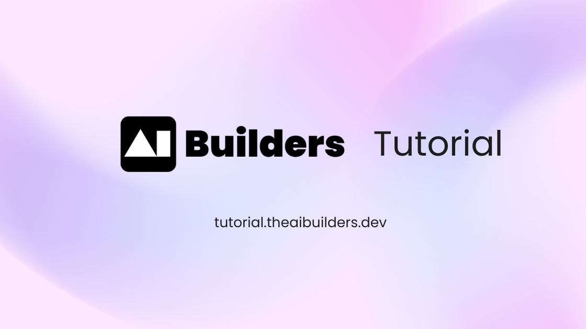

# AI Builders Tutorial Platform

Welcome to AI Builders Tutorial! This is a comprehensive, hands-on tutorial series for viber coding as well as building AI applications using modern tools 🚀

## What You'll Learn

Each tutorial is designed to be practical and immediately applicable:

• **Concise and To-the-point**: We cover the most important concepts of each tool for you to get started quickly
• **Hands-on Examples**: Every concept includes working code you can run and modify
• **Best Practices**: Learn industry-standard approaches and common pitfalls to avoid
• **Progressive Complexity**: Start with basics and advance to sophisticated implementations

Tutorials are written in Python or TypeScript with concise explanations and runnable code / notebooks. Many include copy‑friendly prompts and refactor patterns so you can adapt them directly into real projects.

## Tutorial Categories

Below is a quick mental map of the content areas. Open a category in the sidebar to explore individual tools, frameworks, and notebooks.

### Vibe Coding
Leverage AI‑native editors (Cursor, Windsurf, etc.) plus one‑click deploy flows to supercharge iteration beyond simple “chat” usage—own your code, not just generated files.

### Automation
Connect AI + workflow engines (n8n, Zapier‑style orchestration, background jobs) to trigger agents or model calls from events and pipelines.

### Model Providers
Call, configure, and optimize a wide range of proprietary & open model APIs (latency, quality, fallbacks, cost shaping).

### Gateways
Unify multiple providers behind one interface with routing, retries, caching, usage tracking, and graceful degradation.

### Frameworks
End‑to‑end application scaffolds: retrieval augmentation, tool‑calling agents, multi‑step orchestration, structured outputs, evaluation harnesses.

### Chat UI Framework
Rapidly build production‑ready conversational & multimodal interfaces with state management, streaming, and tool feedback loops.

### Observability
Instrument, trace, evaluate, and debug LLM/agent behavior in staging & prod; collect spans, prompts, scores, and regression signals.

### Fine Tuning
Adapt base models to domain style or task specifics; cover dataset prep, parameter‑efficient methods, evaluation & iteration.

### Data & Memory
Embed, store, and retrieve context using vector databases, hybrid search, chunking strategies, and long‑horizon memory patterns.

### Web Search
Integrate live search, crawling, proxy rotation, and SERP/structured extraction to ground responses in current information.

### Browser Use
Empower agents to navigate, extract, and act within live web contexts (headless & interactive) for research, QA, and scripted tasks.

### Audio / Realtime
Low‑latency speech recognition, streaming synthesis, and realtime bidirectional agent experiences.

### Image & Video
Generate & manipulate visual media (diffusion, video pipelines, asset optimization, multimodal grounding).

## Ready to Take Your AI Journey Further?

### Visit AI Builders

Ready to dive deeper into the world of AI development? Visit **[AI Builders](https://theaibuilders.dev/)** for more resources, advanced tutorials, and the latest insights in AI development.

### Join Our Community

Connect with fellow AI builders from around the world! Join our vibrant community at **[AI Builders Community](https://theaibuilders.dev/community)** where you can:

- Share your projects and get feedback
- Ask questions and get help from experienced developers
- Collaborate on exciting AI projects
- Stay updated with the latest AI trends and technologies
- Network with AI enthusiasts and professionals globally

Whether you're just starting out or you're an experienced developer, our community welcomes everyone who's passionate about building with AI. Come join us and be part of the future of AI development!
