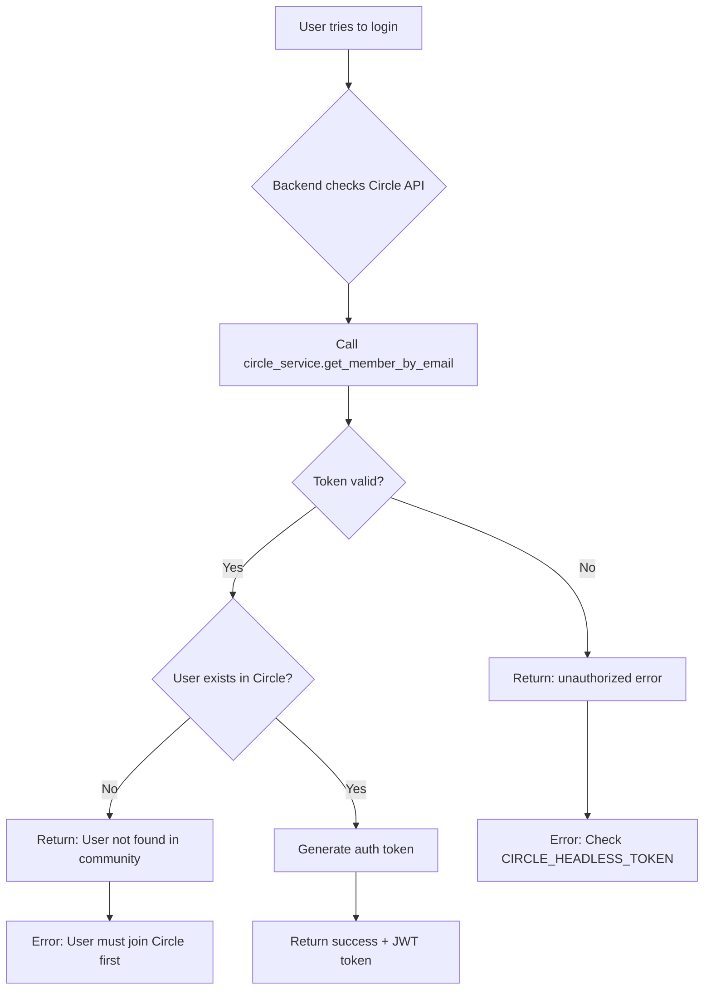

# Circle API Token Setup Guide

## Problem: "User not found in community" Error

If you're seeing the "User not found in community" error when trying to log in, it's likely because:

1. **Circle API token is invalid or expired**
2. **Circle API token doesn't have the right permissions**
3. **The user email doesn't exist in your Circle community**

## Solution: Get a Valid Circle Headless API Token

### Step 1: Access Circle Admin Panel

1. Go to your Circle community admin panel
2. URL format: `https://app.circle.so/admin/{your-community-slug}`
3. Example: `https://app.circle.so/admin/theaibuilders`

### Step 2: Navigate to Settings → Integrations

1. Click on **Settings** in the left sidebar
2. Click on **Integrations**
3. Scroll down to find **Headless API** section

### Step 3: Generate Headless API Token

1. In the **Headless API** section, you'll see:
   - **Community ID** (a number like `389235`)
   - **Headless API Token** (click "Generate" if you don't have one)

2. Click **"Generate New Token"** button
   - This will create a new headless API token
   - ⚠️ **Warning**: This will invalidate any existing tokens!

3. Copy both values:
   - Community ID
   - Headless API Token (starts with random letters/numbers)

### Step 4: Update Backend .env File

Edit `/services/backend/.env` and update these values:

```env
# Circle API
CIRCLE_HEADLESS_TOKEN=your_new_token_here
CIRCLE_COMMUNITY_ID=your_community_id_here
CIRCLE_API_URL=https://app.circle.so/api/v1
```

**Example:**
```env
CIRCLE_HEADLESS_TOKEN=fCR2BpRETQBS7VSgg4wRMHrZQTEmhLuL
CIRCLE_COMMUNITY_ID=389235
CIRCLE_API_URL=https://app.circle.so/api/v1
```

### Step 5: Restart Backend Server

```bash
# Stop the backend if it's running (Ctrl+C)

# Restart it
make dev-backend
```

Or manually:
```bash
cd services/backend
source venv/bin/activate
python main.py
```

## Testing the Token

### Test 1: Verify Token Works

Run this test script to verify your Circle API token:

```bash
cd services/backend
source venv/bin/activate
python -c "
import asyncio
import httpx
import os
from dotenv import load_dotenv

load_dotenv()

async def test():
    token = os.getenv('CIRCLE_HEADLESS_TOKEN')
    api_url = os.getenv('CIRCLE_API_URL')
    
    headers = {
        'Authorization': f'Bearer {token}',
        'Content-Type': 'application/json'
    }
    
    async with httpx.AsyncClient() as client:
        response = await client.get(
            f'{api_url}/community_members',
            headers=headers,
            params={'limit': 1},
            timeout=10.0
        )
        data = response.json()
        
        if data.get('status') == 'unauthorized':
            print('❌ Token is INVALID')
            print(f'Error: {data.get(\"message\")}')
            print('Please generate a new token in Circle admin panel')
        else:
            print('✅ Token is VALID!')
            print(f'Found {len(data.get(\"community_members\", []))} members')

asyncio.run(test())
"
```

### Test 2: Check if User Email Exists in Circle

Replace `user@example.com` with the email you're trying to log in with:

```bash
cd services/backend
source venv/bin/activate
python -c "
import asyncio
import httpx
import os
from dotenv import load_dotenv

load_dotenv()

async def test():
    token = os.getenv('CIRCLE_HEADLESS_TOKEN')
    api_url = os.getenv('CIRCLE_API_URL')
    email = 'user@example.com'  # Change this!
    
    headers = {
        'Authorization': f'Bearer {token}',
        'Content-Type': 'application/json'
    }
    
    async with httpx.AsyncClient() as client:
        response = await client.get(
            f'{api_url}/community_members',
            headers=headers,
            params={'email': email},
            timeout=10.0
        )
        data = response.json()
        
        if data.get('status') == 'unauthorized':
            print('❌ Token is invalid')
        else:
            members = data.get('community_members', [])
            if members:
                print(f'✅ User found: {members[0].get(\"email\")}')
                print(f'Name: {members[0].get(\"name\")}')
                print(f'ID: {members[0].get(\"id\")}')
            else:
                print(f'❌ User NOT found with email: {email}')
                print('This user needs to join the Circle community first!')

asyncio.run(test())
"
```

## Common Issues

### Issue 1: "unauthorized" Error

**Symptom**: API returns `{"status":"unauthorized","message":"Your account could not be authenticated."}`

**Solution**:
1. Token is expired or invalid
2. Generate a new token in Circle admin panel
3. Update `.env` file
4. Restart backend server

### Issue 2: "User not found in community"

**Symptom**: Login fails with "User not found in community" error

**Possible Causes**:
1. User email doesn't exist in Circle community
   - **Solution**: User needs to sign up at your Circle community first
   
2. Email mismatch
   - **Solution**: Check that the email exactly matches what's in Circle
   
3. User was removed from community
   - **Solution**: Re-invite user to Circle community

### Issue 3: Wrong Community ID

**Symptom**: Token works but no members found

**Solution**:
1. Verify your Community ID in Circle admin panel
2. Make sure `CIRCLE_COMMUNITY_ID` in `.env` matches
3. Restart backend

## Circle API Documentation

For more details, refer to:
- [Circle Headless API Documentation](https://api.circle.so/headless-api)
- [Circle API Reference](https://api.circle.so/)

## Token Security

⚠️ **Important Security Notes**:

1. **Never commit tokens to Git**
   - The `.env` file is already in `.gitignore`
   - Double-check before committing

2. **Rotate tokens regularly**
   - Generate new tokens periodically
   - Especially after team member changes

3. **Use different tokens for dev/prod**
   - Development: Use a test community or limit permissions
   - Production: Use production community with full permissions

4. **Store production tokens securely**
   - Use environment variables in your hosting platform
   - Never hardcode in source code

## Workflow Summary



## Need Help?

If you're still having issues:

1. Check backend logs for detailed error messages
2. Run the test scripts above to diagnose the issue
3. Verify your Circle admin panel access
4. Contact Circle support if API is not working

## Related Files

- Backend service: `services/backend/services/circle_service.py`
- Backend auth: `services/backend/routers/auth.py`
- Configuration: `services/backend/config.py`
- Environment: `services/backend/.env`
- Frontend login: `services/frontend/src/islands/LoginForm.tsx`
